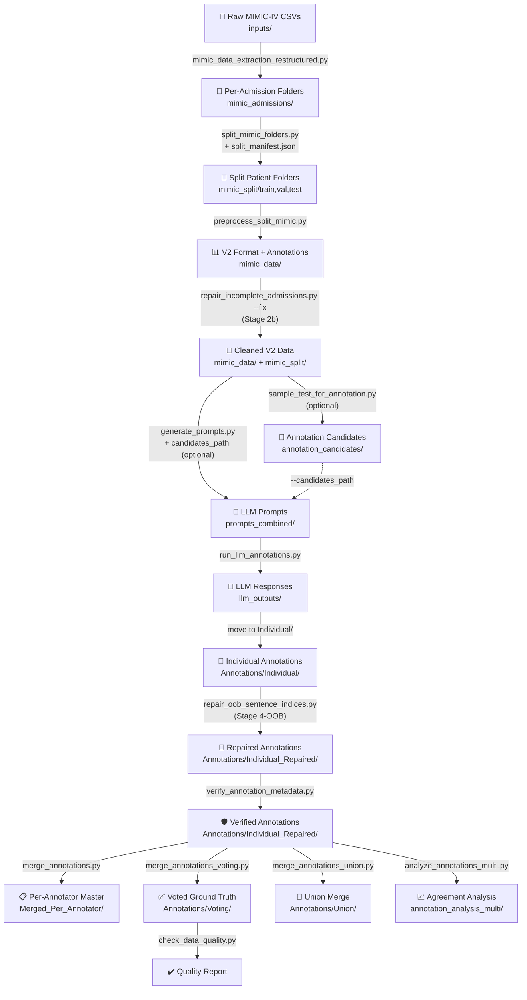

# MIMIC Annotation Pipeline

> [!TIP]
> **Looking to run the code?** Skip directly to the [How to Re-Run the Pipeline](#how-to-re-run-the-pipeline-data-reconstruction) section at the bottom of this README for actionable instructions.

## Summary

This codebase implements a **clinical relationship annotation pipeline** for the LOKI project. Starting from raw MIMIC-IV CSV tables (`inputs/`), it extracts and restructures data into per-admission folders, preprocesses into the v2 format, generates annotation prompts, automatically runs them through one or more LLMs via **OpenRouter** (any cloud model) or a local **LM Studio** server, merges responses via majority voting, and produces final ground-truth annotation files.

---

## Dataset Dependencies

To reproduce this pipeline, you must acquire the following restricted-access datasets from PhysioNet:

1. **MIMIC-IV (hosp module)**: Contains the core clinical records, specifically the hospital admission, diagnoses, and prescription tables.
   - **Link**: [https://physionet.org/content/mimiciv/3.1/](https://physionet.org/content/mimiciv/3.1/)
   - **Citation**: Johnson, Alistair, et al. "MIMIC-IV" (version 3.1). PhysioNet (2024). RRID:SCR_007345. https://doi.org/10.13026/kpb9-mt58.

2. **MIMIC-IV-Note**: Contains the de-identified free-text clinical notes, specifically the discharge summaries.
   - **Link**: [https://physionet.org/content/mimic-iv-note/2.2/](https://physionet.org/content/mimic-iv-note/2.2/)
   - **Citation**: ohnson, Alistair, et al. "MIMIC-IV-Note: Deidentified free-text clinical notes" (version 2.2). PhysioNet (2023). RRID:SCR_007345. https://doi.org/10.13026/1n74-ne17.

---

## Pipeline Overview (Execution Order)



---

## Stage-by-Stage Breakdown

### Stage 0: Raw MIMIC-IV Data Extraction

#### Script: [mimic_data_extraction_restructured.py](mimic_data_extraction_restructured.py)

**Purpose**: The true starting point. Converts raw MIMIC-IV database CSV tables into per-patient, per-admission folder structures that the rest of the pipeline consumes.

**Input** — `inputs/` directory containing raw MIMIC-IV CSV tables:
| File | Size | Contents |
|------|------|----------|
| `diagnoses_icd.csv` | 173 MB | All diagnosis records (subject_id, hadm_id, icd_code, seq_num) |
| `prescriptions.csv` | 3.2 GB | All prescription/medication records |
| `discharge.csv` | 3.3 GB | All discharge summary clinical notes |
| `patients.csv` | 11 MB | Patient demographics (age, gender) |
| `d_icd_diagnoses.csv` | 8.7 MB | ICD code reference table (code → long title) |

**Output** → `mimic_admissions/`:
```
mimic_admissions/
└── <subject_id>/
    └── <hadm_id>/
        ├── <hadm_id>-diagnosis.csv    # Enriched with ICD long titles
        ├── <hadm_id>-medication.csv   # Cleaned prescriptions
        └── <hadm_id>-notes.txt        # Discharge summary text
```

**What it does step by step** (3 phases):

1. **Phase 1 — Find valid patients** (lines 32–98):
   - Reads `diagnoses_icd.csv`, `discharge.csv`, and `prescriptions.csv` in chunks (memory efficient)
   - Tracks which `(subject_id, hadm_id)` pairs appear in all three tables
   - Validates: a patient is "valid" only if **every** admission with diagnoses also has a discharge note **and at least one prescription row** (guarantees non-empty medication CSV)
   - Stops after finding `N_PATIENTS_TO_EXPORT` (default: 10,000) valid patients

2. **Phase 2 — Load full data for selected patients** (lines 103–155):
   - Reads complete records for selected patients from all CSVs
   - Enriches diagnosis table by merging with `patients.csv` (demographics) and `d_icd_diagnoses.csv` (ICD long titles)

3. **Phase 3 — Export per-admission folders** (lines 199–291):
   - For each patient, iterates over their hospital admissions
   - **Diagnosis CSV**: drops internal columns (`anchor_year`, `dod`), renames to clinical names (`seq_num` → `priority`, `long_title` → `diagnosis`)
   - **Medication CSV**: drops pharmacy/formulary columns, renames (`prod_strength` → `contains`, `dose_val_rx` → `dosage`)
   - **Notes**: fixes Windows-1252 mojibake encoding issues, removes `___` anonymization placeholders, combines multiple notes per admission with `===` delimiters

> [!NOTE]
> The script targets 10,000 patients but only ~6,617 passed the validity filter (every admission must have diagnoses, a discharge note, **and at least one prescription row**).

**Configuration** (hardcoded at top of script):
```python
DATA_DIR = "./inputs"                   # Raw MIMIC CSVs
OUTPUT_DIR = "./mimic_admissions"          # Output folder
N_PATIENTS_TO_EXPORT = 10000             # Max patients to extract
```

---

### Stage 1: Split Folders Using Manifest

#### Script: [split_mimic_folders.py](split_mimic_folders.py)

**Purpose**: Physically separates patient folders into train/val/test directories using `split_manifest.json` as the source of truth.

**Input**:
- `mimic_admissions/` — Source patient folders (from Stage 0)
- `./split_manifest.json` — Defines exact patient splits

**Output** → `mimic_split/`:
| Folder | Content |
|--------|---------|
| `train/` | ~5,295 patient folders |
| `val/` | ~661 patient folders |
| `test/` | ~661 patient folders |
| `split_summary.json` | Operation summary |

> [!IMPORTANT]
> The `split_manifest.json` in the project root is the **single source of truth** for patient splits. It was generated once. Never regenerate it — always reuse it.

---

### Stage 2: Preprocess Splits to V2 Format

#### Script: [preprocess_split_mimic.py](preprocess_split_mimic.py)

**Purpose**: Converts the physically-split patient folders into the v2 enhanced format used by the rest of the pipeline.

**Input**: `mimic_split/train/`, `mimic_split/val/`, `mimic_split/test/`

**Output** → `mimic_data/`:
| File | Description |
|------|-------------|
| `train_row_level_v2.json` | Training examples in v2 format |
| `val_row_level_v2.json` | Validation examples in v2 format |
| `test_row_level_v2.json` | **~585 MB** — Test examples in v2 format (~2,498 examples) |
| `annotations/test_annotations.json` | Blank annotation templates (all `"pending"`) |
| `processing_summary.json` | Processing metadata |

**What it does**:
1. For each split (train/val/test), loads raw admission data from patient folders
2. Converts to "protrix format" (rows + sentences + negatives)
3. Transforms to "v2 enhanced format" (adds section detection, sentence indexing)
4. Generates blank annotation templates for the test set

**Key detail**: Each patient-admission produces **TWO examples** — one for the diagnosis table and one for the medication table, paired with the same clinical notes document.

**Note**: This imports core functions from `preprocess_mimic.py` (data loading, format conversion, v2 transformation).

---

### Stage 2b: Repair Incomplete Admissions

#### Script: [repair_incomplete_admissions.py](repair_incomplete_admissions.py)

**Purpose**: Removes admissions that have no medication rows from both `mimic_split/` and `mimic_data/`. Stage 0 exports a `{hadm_id}-medication.csv` even when an admission has zero prescription rows (headers-only file). Stage 2 then skips those empty tables, leaving the admission with only a diagnosis example — no medication example. `generate_prompts.py` flags these as `[WARNING] Incomplete admission`. This script finds and removes them so every downstream admission is complete.

**Must run after**: Stage 2 (`preprocess_split_mimic.py`)  
**Must run before**: Stage 3b (`generate_prompts.py`)

**Input**:
- `mimic_split/{train,val,test}/` — split patient folders (from Stage 1)
- `mimic_data/{split}_row_level_v2.json` — preprocessed v2 data (from Stage 2)
- `split_manifest.json` — patient split manifest (updated in-place)

**Output**: All inputs are patched in-place — no new directories created.

```bash
# Dry-run first — reports which admissions would be removed (safe, no changes)
python repair_incomplete_admissions.py

# Apply the fix
python repair_incomplete_admissions.py --fix
```

> [!WARNING]
> Always run the dry-run first to review which admissions will be removed. The `--fix` flag modifies `mimic_split/`, `mimic_data/*.json`, and `split_manifest.json` in-place.

---

### Stage 3a: Sample Test Admissions for Annotation

#### Script: [sample_test_for_annotation.py](sample_test_for_annotation.py)

**Purpose**: Selects a balanced subset of the 659 test patients (≈380 admissions) for LLM annotation. Running the full 1,250 admissions through three LLMs is prohibitively expensive; this script down-samples to a class-balanced cohort that maximises expected rare-class yield.

**Input**: `mimic_split/test/` — the per-admission folders from Stage 1

**Output** → `annotation_candidates/`:
| File | Description |
|------|-------------|
| `patient_relation_scores.csv` | Admission-level relationship signal scores (1 row per `hadm_id`) |
| `selected_patients.csv` | 111 selected patient IDs with selection reason and score |
| `selection_stats.json` | Detailed per-class statistics of the final selection |

**What it does** (two internal stages):
1. **Score** — Scans every note file in `TEST_DIR` and scores each admission on all four relationship classes using entity-anchored keyword matching (ADVERSE_EFFECT, DISCONTINUED, TREATS) and a 36-pair knowledge-base lookup (CONTRAINDICATED).
2. **Select** — Aggregates scores per patient, then runs Stratified Priority Selection in `score_target` mode: fills ADVERSE_EFFECT, CONTRAINDICATED, DISCONTINUED pools to a shared score target (auto-computed as the minimum achievable at `N_PER_CLASS=25`), then fills the remainder to `TARGET_COUNT` with TREATS-filler patients.

**Key arguments**:
```bash
python sample_test_for_annotation.py \
    --test_dir   mimic_split/test          \ # default
    --output_dir annotation_candidates     \ # default
    --target_count 111                     \ # default
    --balance_mode score_target            \ # "fixed" | "score_target"
    --n_per_class  25                      \ # reference N for auto target
    --score_target 100                       # omit for auto
```

> [!NOTE]
> This stage is **optional** — if you want prompts for all 1,250 test admissions, skip to Stage 3b and omit `--candidates_path`.

---

### Stage 3b: Generate LLM Annotation Prompts

#### Script: [generate_prompts.py](generate_prompts.py)

**Purpose**: Produces two artefacts from `annotation_prompt.md` and the v2 test data:

1. **`system_prompt.md`** — the static annotation instructions (written once). Used as the `system` message in API calls, or pasted once into a chat window at the start of a manual annotation session.
2. **`prompts_combined/*.md`** — one minimal data file per admission containing only the diagnosis table, medication table, indexed clinical note sentences, and the JSON output skeleton. These contain no repeated instructions, keeping them small and cheap to send.

Separating the two parts enables **prompt caching** (the static instructions are only billed once per session), while manual annotators benefit from a cleaner copy-paste workflow.

**Input**:
- `mimic_data/test_row_level_v2.json` — The v2 test data
- `annotation_prompt.md` — The prompt template (source of truth for instructions)
- `annotation_candidates/selected_patients.csv` *(optional)* — Candidate filter from Stage 3a

**Output**:
| File | Description |
|------|-------------|
| `system_prompt.md` | Static annotation instructions (~1,200 words). Send once as the system message or paste once into a chat window. |
| `prompts_combined/prompt_combined_<pid>_<adm>.md` | Per-admission data (tables + sentences + JSON skeleton). One file per admission, ~2,500 words each. |

**Key arguments**:
```bash
# Recommended: generate only for the sampled patients (~380 admissions)
python generate_prompts.py \
    --data_path       mimic_data/test_row_level_v2.json \
    --candidates_path annotation_candidates/selected_patients.csv \
    --output_dir      prompts_combined

# Alternative: generate for all 1,250 test admissions (no sampling filter)
python generate_prompts.py \
    --data_path  mimic_data/test_row_level_v2.json \
    --output_dir prompts_combined

# Single admission
python generate_prompts.py \
    --data_path    mimic_data/test_row_level_v2.json \
    --admission_id 28979390

# Custom output locations
python generate_prompts.py \
    --output_dir         prompts_combined \
    --system_prompt_path system_prompt.md
```

---

### Stage 4: Run LLM Annotations Automatically

#### Script: [run_llm_annotations.py](run_llm_annotations.py)

**Purpose**: Reads `system_prompt.md` (the static instructions from Stage 3b) as the `system` message and each `prompts_combined/*.md` file as the `user` message, calls the LLM, extracts the JSON annotation block, and saves a per-admission JSON file. Supports any model available on **OpenRouter** (cloud) or a locally-running **LM Studio** server.

Sending the instructions as a cached system message means they are only billed once per session — only the variable data section is charged on every call.

**Input**:
- `system_prompt.md` — static annotation instructions (system message, cached)
- `prompts_combined/*.md` — per-admission data files from Stage 3b (user message, billed per call)

**Output** → `llm_outputs/<model-name>/`:
- One `annotation_<patient_id>_<admission_id>.json` per processed prompt
- One `annotation_<patient_id>_<admission_id>.error.json` for any failed calls
- Output folder is automatically named after the model (e.g. `llm_outputs/openai__gpt-4o/`)

**Environment variables**:
| Variable | Used by | Purpose |
|----------|---------|---------|
| `OPENAI_API_KEY` | `openrouter` | Your OpenRouter API key |
| `LM_API_TOKEN` | `lmstudio` | Bearer token (leave unset if server has no auth) |

**Key arguments**:
```bash
# Annotation (API call) mode
--provider         openrouter | lmstudio       # required (unless --create_templates)
--model            <model-id>                  # e.g. openai/gpt-4o, ibm/granite-4-micro
--system_prompt    system_prompt.md            # default; static instructions (system message)
--input_dir        prompts_combined            # default; per-admission data files
--input_file       path/to/single_prompt.md   # single-file mode
--admission_id     23223704                    # filter to one admission
--output_dir       llm_outputs                 # default root; subdir named after model
--delay            1.0                         # seconds between calls (default 1.0)
--max_retries      3                           # retries on failure with exponential backoff
--force                                        # overwrite existing outputs
--dry_run                                      # preview without making API calls
--base_url         http://localhost:1234       # LM Studio server URL (lmstudio only)

# Template scaffold mode (no API key required)
--create_templates                             # write pre-filled skeleton JSONs for manual annotators
--templates_dir    annotation_templates        # default output folder for skeleton files
```

**Usage examples**:
```bash
# --- OpenRouter (cloud) ---

# Set your OpenRouter API key once
export OPENAI_API_KEY="sk-or-..."       # Linux/macOS
$env:OPENAI_API_KEY = "sk-or-..."       # PowerShell

# Run all prompts through GPT-4o  →  llm_outputs/openai__gpt-4o/
python run_llm_annotations.py --provider openrouter --model openai/gpt-4o

# Any other OpenRouter model slug works the same way
python run_llm_annotations.py --provider openrouter --model anthropic/claude-opus-4-5
python run_llm_annotations.py --provider openrouter --model google/gemini-2.5-pro

# Test a single admission before running the full set
python run_llm_annotations.py --provider openrouter --model openai/gpt-4o --admission_id 23223704

# Preview which files would be processed (no API calls)
python run_llm_annotations.py --provider openrouter --model openai/gpt-4o --dry_run

# --- LM Studio (local) ---

# Start LM Studio, load a model, enable the local server, then:
python run_llm_annotations.py --provider lmstudio --model ibm/granite-4-micro

# Remote or non-default port
python run_llm_annotations.py --provider lmstudio --model ibm/granite-4-micro \
    --base_url http://192.168.1.10:1234

# --- Template scaffolds for manual annotators (no API key needed) ---

# Create pre-filled skeleton JSONs in annotation_templates/ (one per prompt)
python run_llm_annotations.py --create_templates

# Custom templates output folder
python run_llm_annotations.py --create_templates --templates_dir my_templates

# Skip already-created templates; use --force to regenerate
python run_llm_annotations.py --create_templates --force
```

> [!NOTE]
> Already-processed admissions are automatically skipped on re-run (resume support). Use `--force` to overwrite.

> [!TIP]
> Run the same prompts through multiple models to get independent annotators for majority voting — each model writes to its own subfolder under `llm_outputs/`.

---

#### Alternative: Manual Annotation (No API Required)

If you prefer to annotate without an API key — or want to use a web interface (ChatGPT, Claude, Gemini, Copilot, etc.) — you can do the same thing by hand. The prompt split makes this efficient: paste the instructions once, then annotate many admissions in the same conversation.

**Step 0 (optional) — Generate skeleton JSON files as starting points**

```bash
python run_llm_annotations.py --create_templates
```

This creates one pre-filled `annotation_<pid>_<adm>.json` per prompt in `annotation_templates/`. Each file already contains the correct `patient_id`, `admission_id`, `diagnosis_anchor_id`, and `medication_anchor_id`, with all annotation fields (`row_grounding`, `relationships`, etc.) blank and ready to fill in. Using these skeletons avoids retyping IDs and ensures the output structure is correct.

**Step 1 — Load the instructions (once per session)**

Open `system_prompt.md` and paste its full contents into your LLM chat window. This sets the annotation context for the whole session. In interfaces that support a system/custom-instruction field (ChatGPT custom instructions, Claude system prompt, etc.) you can paste it there instead.

**Step 2 — Annotate each admission**

For each admission you want to annotate:

1. Open its data file from `prompts_combined/`, e.g. `prompt_combined_10000764_27897940.md`
2. Paste the file contents as a new message in the same chat
3. Copy the JSON block the model returns
4. Save it as `annotation_<patient_id>_<admission_id>.json`  
   (e.g. `annotation_10000764_27897940.json`)  
   *(If you generated templates in Step 0, open the matching skeleton from `annotation_templates/` and fill in the fields instead of starting from scratch.)*
5. Place it in the annotator folder:
   ```
   Annotations/Individual/annotator-<your-label>/annotation_10000764_27897940.json
   ```
6. Repeat from step 1 of Step 2 for the next admission

> [!TIP]
> The JSON must contain at minimum `row_grounding`, `relationships`, `patient_id`, `admission_id`, `diagnosis_anchor_id`, and `medication_anchor_id`. If the model wraps its output in a markdown code fence (` ```json ... ``` `), `merge_annotations.py` strips the fences automatically.

> [!NOTE]
> The automated script and the manual approach produce identically-structured JSON files and feed into the same downstream pipeline steps (Stage 4a onward). You can freely mix outputs from both approaches across different annotator folders.

---

### Stage 4-OOB: Repair Out-of-Bounds Sentence Indices

#### Script: [repair_oob_sentence_indices.py](repair_oob_sentence_indices.py)

**Purpose**: Strips sentence indices that exceed the valid range of the source document from all individual annotation files. LLM annotators sometimes reference sentence indices that fall outside the windowed subset stored in the v2 data (they were given the full discharge note but the pipeline only stores a window). Additionally, some annotators leave `sentences: []` or `sentences: [null, ...]` in grounding rows — this script removes those empty/null grounding rows entirely, which prevents downstream quality errors in the voting merge.

**Must run after**: Stage 4 (annotations placed in `Annotations/Individual/`)  
**Must run before**: Stage 4a (`verify_annotation_metadata.py`)

**Input**:
- `Annotations/Individual/` — per-annotator annotation files
- `mimic_data/{test,val,train}_row_level_v2.json` — used to determine valid sentence bounds per admission

**Output** → `Annotations/Individual_Repaired/` (originals are never modified):
- All annotation files copied with OOB indices stripped and empty grounding rows removed
- `Annotations/oob_repair_report.json` — detailed repair report per annotator and per file

```bash
# Run the repair (reads Individual/, writes Individual_Repaired/)
python repair_oob_sentence_indices.py

# Quiet mode (suppress per-file output)
python repair_oob_sentence_indices.py --quiet
```

> [!IMPORTANT]
> After running this script, **replace the original directory with the repaired one** so all subsequent stages work with their default paths:
> ```bash
> # Windows (PowerShell)
> Remove-Item -Recurse -Force Annotations/Individual
> Rename-Item Annotations/Individual_Repaired Annotations/Individual
> # Linux / macOS
> rm -rf Annotations/Individual && mv Annotations/Individual_Repaired Annotations/Individual
> ```

> [!NOTE]
> The repair report prints per-annotator counters distinguishing rows **dropped because all sentences were OOB** from rows **dropped because sentences was `[]` to begin with**. The latter are the more common case and are the root cause of the grounding-relationship consistency errors caught by `check_data_quality.py`.

---

### Stage 4a: Verify Annotation Metadata

#### Script: [verify_annotation_metadata.py](verify_annotation_metadata.py)

**Purpose**: Ensures all individual LLM response files have consistent and correct metadata (`patient_id`, `admission_id`, `diagnosis_anchor_id`, `medication_anchor_id`). This is critical after manual folder reorganization.

**What it does**:
1. Traverses all annotator subdirectories.
2. Infers missing metadata from folder names and filenames.
3. Calculates stable anchor IDs using SHA256 hashing.
4. Patches the JSON files with the correct information.

```bash
python verify_annotation_metadata.py
```

---

### Stage 4b: Merge into Per-Annotator Masters

#### Script: [merge_annotations.py](merge_annotations.py)

**Purpose**: Merges individual responses into a per-annotator master file for easier analysis or backup.

#### Script: [merge_annotations_voting.py](merge_annotations_voting.py)

**Purpose**: Merges annotations from all annotators using **majority voting**. This is the critical final merge step. It dynamically detects annotator directories or master files.

**Command Usage**:
```bash
# Default (Reads subdirectories in Annotations/Individual)
python merge_annotations_voting.py

# Custom directory (Reads master JSON files)
python merge_annotations_voting.py --input_dir Annotations/Merged_Per_Annotator/

# Include Explanations (By default reasonings are "anonymized" for data sec, use this flag to restore):
python merge_annotations_voting.py --include-reasoning
```

**Input**:
- `--input_dir`: Path containing annotator folders or individual `.json` master files.

**Output** → `Annotations/Voting/`:
| File | Description |
|------|-------------|
| `<admission_id>.json` | Individual merged annotation per admission |
| `merged_annotations_all.json` | All annotated admissions combined |
| `merge_provenance.json` | **72 KB** — Detailed provenance tracking |
| `data_quality_report.json` | Quality check results |
---

### Stage 5 (Alternative): Union Merge

#### Script: [merge_annotations_union.py](merge_annotations_union.py)

**Purpose**: Alternative merge strategy that keeps **ALL** relationships from both annotators (designed for 2 annotators, not 3).

**Key difference from voting**: Nothing is dropped. Every relationship from every annotator is preserved with provenance tracking (`_agreement: "both"`, `"annotator_1_only"`, `"annotator_2_only"`).

**Input**: Two annotator folders
**Output**: Similar structure to voting output but with union semantics

> [!TIP]
> If you want to keep ALL annotated relationships in the ground truth, you could adapt this union strategy for 3 annotators, or modify the voting script to include minority annotations with a flag instead of dropping them.

---

### Stage 6: Inter-Annotator Agreement Analysis

#### Script: [analyze_annotations_multi.py](analyze_annotations_multi.py)

**Purpose**: Comprehensive statistical analysis of agreement across annotators. Dynamically reads folders or files.

**Command Usage**:
```bash
python analyze_annotations_multi.py --input_dir Annotations/Merged_Per_Annotator/
```

**Input**: `--input_dir` pointing to annotator JSON files or subdirectories.

**Output** → `annotation_analysis_multi/`:
| File | Description |
|------|-------------|
| `multi_annotator_analysis.json` | Full metrics (Fleiss' κ, pairwise κ, voting distribution, etc.) |
| `pairwise_agreement_heatmap.png` | Pairwise agreement visualization |
| `pairwise_kappa_heatmap.png` | Cohen's κ pairwise |
| `voting_distribution.png` | 1-vote vs 2-vote vs 3-vote distribution |
| `per_annotator_stats.png` | Per-annotator relationship counts |
| `mention_types_by_annotator.png` | Mention type usage comparison |
| `evidence_scope_agreement.png` | Scope classification agreement |
| And more... | Various visualization charts |

---

### Stage 7: Data Quality Check

#### Script: [check_data_quality.py](check_data_quality.py)

**Purpose**: Validates the merged (voted) annotations for data quality before model training.

**Input**: Target file to validate via `--input_file` (defaults to `Annotations/Voting/merged_annotations_all.json`).

**Command Usage**:
```bash
python check_data_quality.py --input_file Annotations/Voting/merged_annotations_all.json
```

**Output**: `data_quality_report.json` + console report

**Checks**: Required fields, valid relationship types, provenance tracking, mention type validation, evidence sentence presence.

---

### Utility Scripts

#### [find_minimal_example.py](find_minimal_example.py)
Finds the simplest annotated example (fewest rows + sentences) for visualization purposes.

#### [show_minimal_example.py](show_minimal_example.py)
Displays details of the minimal example (admission `28979390`).

---

## File Inventory: What Exists and Where It Came From

### Generated Data Files

| File | Size | Generated By | Stage | Status |
|------|------|-------------|-------|--------|
| `inputs/*.csv` | ~7 GB total | MIMIC-IV database export | — | ✅ Source data |
| `mimic_admissions/` (per-admission folders) | ~6,617 patients | `mimic_data_extraction_restructured.py` | 0 | ✅ Complete |
| `mimic_split/` | — | `split_mimic_folders.py` | 1 | ✅ Complete |
| `mimic_data/test_row_level_v2.json` | 585 MB | `preprocess_split_mimic.py` | 2 | ✅ Complete |
| `mimic_data/split_manifest.json` | 128 KB | Project Root / Custom | 1 | ✅ Complete |
| `mimic_data/annotations/test_annotations.json` (Blank Initially) | 2.5 MB | `preprocess_split_mimic.py` | 2 | ⚠️ ALL `"pending"` |
| `system_prompt.md` | ~10 KB | `generate_prompts.py` | 3b | ✅ Complete |
| `prompts_combined/*.md` | One per admission (data only) | `generate_prompts.py` | 3b | ✅ Complete |
| `annotation_templates/*.json` | One skeleton per admission | `run_llm_annotations.py --create_templates` | 4 | ⚙️ Optional — for manual annotators |
| `Annotations/Individual/annotator-*/` | 229 files each | `run_llm_annotations.py` or manual | 4 | ✅ Complete |
| `Annotations/Merged_Per_Annotator/annotator-*.json` | 1 master each | `merge_annotations.py` | 4b | ✅ Complete |
| `Annotations/Voting/*.json` | 21 files | `merge_annotations_voting.py` | 5 | ✅ Complete |
| `annotation_analysis_multi/*.png` | 15 files | `analyze_annotations_multi.py` | 7 | ✅ Complete |

---

## The Master `test_annotations.json` Reference

The open-source repository distributes the pure, fully-voted ground truth inside the `ground_truth/` directory. 

| Location | Entries | Status | Source |
|----------|---------|--------|--------|
| `ground_truth/test_annotations.json` | 2,498 | ✅ Partially Annotated (229 admissions, 2,040 pending) | Supplied Golden Reference |

The **raw intermediate voter files** live in:
- `Annotations/Voting/merged_annotations_all.json` — 229 admissions, voted results
- `Annotations/Merged_Per_Annotator/*.json` — Per-annotator unified responses


## Annotation Coverage Summary

The final `test_annotations.json` is a **partial annotation** containing all 2,498 test entries, but only 229 admissions (458 table entries) have actual ground-truth data:

| Category | Count |
|----------|-------|
| Total test entries in template | 2,498 |
| Annotated admissions | **229** (→ 458 table entries) |
| Unannotated entries | 2,040 (remain `"pending"`) |

Within the 229 annotated admissions, the voting merge (≥2/3 agreement threshold) is **expected behavior** — the `merge_provenance.json` tracks excluded minority relationships for auditability.

---

## How to Re-Run the Pipeline (Data Reconstruction)

The open-source release supplies the finalized ground truth directly at `ground_truth/test_annotations.json` inside the repository. **You only need to execute Stages 0 through 2** to reconstruct the private clinical notes. Once Stage 2 is complete, your local environment will automatically pair with the supplied annotations, and you can immediately proceed to run the model evaluators.

```bash
# Stage 0: Extract raw MIMIC-IV CSVs into per-admission folders
# (Requires inputs/ directory populated with the PhysioNet CSVs)
python mimic_data_extraction_restructured.py

# Stage 1: Split folders using the manifest (source of truth for patient splits)
python split_mimic_folders.py

# Stage 2: Preprocess split folders into v2 format
python preprocess_split_mimic.py

# Stage 2b: Assemble Final Evaluation Payload
# Bundle the reconstructed datasets with our supplied ground truth into a clean structure!
mkdir mimic
cp mimic_data/train_row_level_v2.json mimic/train_row_level.json
cp mimic_data/val_row_level_v2.json mimic/val_row_level.json
cp mimic_data/test_row_level_v2.json mimic/test_row_level.json
cp ground_truth/test_annotations.json mimic/Annotated_Test.json
# -------------------------------------------------------------------------
# ✅ At this point, the `mimic/` environment is fully built! You're ready to evaluate models!
# -------------------------------------------------------------------------
```

---

## Re-producing the LLM Annotations (Optional: will produce different annotations)

If you wish to *re-generate* or *modify* the ground-truth annotations themselves via the LLMs, you can optionally execute stages 3 through 8.

```bash
# Stage 2b: Repair incomplete admissions (empty medication tables)
# Dry-run first — safe, reports what would be removed
python repair_incomplete_admissions.py
# Then apply the fix (modifies mimic_split/, mimic_data/*.json, split_manifest.json in-place)
python repair_incomplete_admissions.py --fix

# Stage 3a: Sample test admissions for annotation (class-balanced subset)
python sample_test_for_annotation.py
# Output: annotation_candidates/selected_patients.csv  (100 patients, ~380 admissions)

# Stage 3b: Generate system_prompt.md (once) + per-admission data files
python generate_prompts.py \
    --data_path       mimic_data/test_row_level_v2.json \
    --candidates_path annotation_candidates/selected_patients.csv \
    --output_dir      prompts_combined
# Output: system_prompt.md  (static instructions, ~1,200 words)
#         prompts_combined/prompt_combined_<pid>_<adm>.md  (one per admission, data only)

# ── Stage 4: Collect Annotations ─────────────────────────────────────────────
#
# OPTION A — Automated via API (OpenRouter or LM Studio)
# system_prompt.md is loaded automatically as the cached system message.
# Each model writes to its own subfolder: llm_outputs/<model-name>/
# Run once per model you want as an independent annotator:
export OPENAI_API_KEY="sk-or-..."        # Linux/macOS
# $env:OPENAI_API_KEY = "sk-or-..."     # PowerShell equivalent
python run_llm_annotations.py --provider openrouter --model openai/gpt-5.4
python run_llm_annotations.py --provider openrouter --model anthropic/claude-opus-4.6
python run_llm_annotations.py --provider openrouter --model google/gemini-3.1-pro-preview
# Or with a local LM Studio server (no API key needed):
python run_llm_annotations.py --provider lmstudio --model ibm/granite-4-micro
#
# OPTION B — Manual (no API key — paste into any chat interface)
# 1. Paste system_prompt.md once into the chat (or as the system/custom instruction).
# 2. For each admission: paste its prompts_combined/*.md file as the next message.
# 3. Copy the JSON response and save as:
#    Annotations/Individual/annotator-<your-label>/annotation_<pid>_<adm>.json
# 4. Repeat step 2 for the next admission (no need to re-paste the instructions).
#
# OPTION C — Template scaffolds (no API key — for human/manual annotators)
# Generates pre-filled skeleton JSONs with all IDs and empty annotation fields.
# Use these as starting points instead of writing JSON from scratch.
python run_llm_annotations.py --create_templates
# Output: annotation_templates/annotation_<pid>_<adm>.json  (one per prompt)
# Open each skeleton, fill in row_grounding and relationships, then move it to:
#   Annotations/Individual/annotator-<your-label>/annotation_<pid>_<adm>.json
#
# After any option, place the completed JSON files under Annotations/Individual/:
# Annotations/Individual/annotator-<model-or-label>/annotation_<pid>_<adm>.json

# Stage 4-OOB: Repair out-of-bounds sentence indices and remove empty grounding rows
# Reads Annotations/Individual/, writes repaired copies to Annotations/Individual_Repaired/
python repair_oob_sentence_indices.py
# Review the summary — it reports per-annotator OOB refs stripped and empty rows dropped
# Then replace the original directory with the repaired one (PowerShell):
Rename-Item Annotations/Individual Annotations/Individual_RAW
Rename-Item Annotations/Individual_Repaired Annotations/Individual
# Linux/macOS: rm -rf Annotations/Individual && mv Annotations/Individual_Repaired Annotations/Individual

# Stage 4a: Verify and patch missing metadata
python verify_annotation_metadata.py

# Stage 4b: Merge into per-annotator master files
python merge_annotations.py
# Input: Annotations/Individual/ → Output: Annotations/Merged_Per_Annotator/

# Stage 5: Merge all annotators by majority voting
python merge_annotations_voting.py
# Input: Annotations/Merged_Per_Annotator/ → Output: Annotations/Voting/
# Note: Appending `--include-reasoning` will include verbatim reasoning text (default is safely anonymized)

# Stage 6: Analyze inter-annotator agreement
python analyze_annotations_multi.py
# Input: Annotations/Individual/annotator_{1,2,3}/ → Output: annotation_analysis_multi/

# Stage 7: Quality check
python check_data_quality.py
# Input: Annotations/Voting/merged_annotations_all.json
# Output: If all checks pass, final annotations are saved to mimic_data/Annotated_Test.json
```
