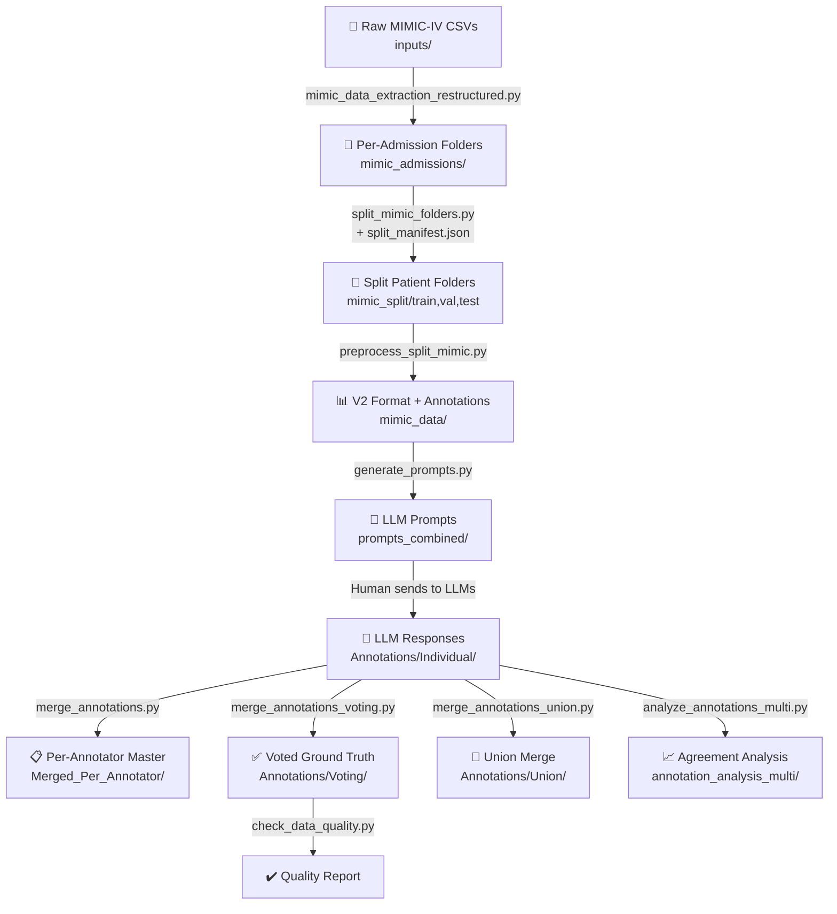

# MIMIC Annotation Pipeline

> [!TIP]
> **Looking to run the code?** Skip directly to the [How to Re-Run the Pipeline](#how-to-re-run-the-pipeline-data-reconstruction) section at the bottom of this README for actionable instructions.

## Summary

This codebase implements a **clinical relationship annotation pipeline** for the LOKI project. Starting from raw MIMIC-IV CSV tables (`inputs/`), it extracts and restructures data into per-admission folders, preprocesses into the v2 format, generates annotation prompts for LLMs, collects annotations from 3 LLM annotators (Gemini, ChatGPT, Qwen), merges them via majority voting, and produces final ground-truth annotation files.

---

## Dataset Dependencies

To reproduce this pipeline, you must acquire the following restricted-access datasets from PhysioNet:

1. **MIMIC-IV (hosp module)**: Contains the core clinical records, specifically the hospital admission, diagnoses, and prescription tables.
   - **Link**: [https://physionet.org/content/mimiciv/3.1/](https://physionet.org/content/mimiciv/3.1/)
   - **Citation**: Johnson, Alistair, et al. "MIMIC-IV" (version 3.1). PhysioNet (2024). RRID:SCR_007345. https://doi.org/10.13026/kpb9-mt58.

2. **MIMIC-IV-Note**: Contains the de-identified free-text clinical notes, specifically the discharge summaries.
   - **Link**: [https://physionet.org/content/mimic-iv-note/2.2/](https://physionet.org/content/mimic-iv-note/2.2/)
   - **Citation**: ohnson, Alistair, et al. "MIMIC-IV-Note: Deidentified free-text clinical notes" (version 2.2). PhysioNet (2023). RRID:SCR_007345. https://doi.org/10.13026/1n74-ne17.

---

## Pipeline Overview (Execution Order)



---

## Stage-by-Stage Breakdown

### Stage 0: Raw MIMIC-IV Data Extraction

#### Script: [mimic_data_extraction_restructured.py](mimic_data_extraction_restructured.py)

**Purpose**: The true starting point. Converts raw MIMIC-IV database CSV tables into per-patient, per-admission folder structures that the rest of the pipeline consumes.

**Input** — `inputs/` directory containing raw MIMIC-IV CSV tables:
| File | Size | Contents |
|------|------|----------|
| `diagnoses_icd.csv` | 173 MB | All diagnosis records (subject_id, hadm_id, icd_code, seq_num) |
| `prescriptions.csv` | 3.2 GB | All prescription/medication records |
| `discharge.csv` | 3.3 GB | All discharge summary clinical notes |
| `patients.csv` | 11 MB | Patient demographics (age, gender) |
| `d_icd_diagnoses.csv` | 8.7 MB | ICD code reference table (code → long title) |

**Output** → `mimic_admissions/`:
```
mimic_admissions/
└── <subject_id>/
    └── <hadm_id>/
        ├── <hadm_id>-diagnosis.csv    # Enriched with ICD long titles
        ├── <hadm_id>-medication.csv   # Cleaned prescriptions
        └── <hadm_id>-notes.txt        # Discharge summary text
```

**What it does step by step** (3 phases):

1. **Phase 1 — Find valid patients** (lines 32–98):
   - Reads `diagnoses_icd.csv` and `discharge.csv` in chunks (memory efficient)
   - Tracks which `(subject_id, hadm_id)` pairs appear in both tables
   - Validates: a patient is "valid" only if **every** admission with diagnoses also has a discharge note
   - Stops after finding `N_PATIENTS_TO_EXPORT` (default: 10,000) valid patients

2. **Phase 2 — Load full data for selected patients** (lines 103–155):
   - Reads complete records for selected patients from all CSVs
   - Enriches diagnosis table by merging with `patients.csv` (demographics) and `d_icd_diagnoses.csv` (ICD long titles)

3. **Phase 3 — Export per-admission folders** (lines 199–291):
   - For each patient, iterates over their hospital admissions
   - **Diagnosis CSV**: drops internal columns (`anchor_year`, `dod`), renames to clinical names (`seq_num` → `priority`, `long_title` → `diagnosis`)
   - **Medication CSV**: drops pharmacy/formulary columns, renames (`prod_strength` → `contains`, `dose_val_rx` → `dosage`)
   - **Notes**: fixes Windows-1252 mojibake encoding issues, removes `___` anonymization placeholders, combines multiple notes per admission with `===` delimiters

> [!NOTE]
> The script targets 10,000 patients but only ~6,617 passed the validity filter (every admission must have both diagnoses AND a discharge note).

**Configuration** (hardcoded at top of script):
```python
DATA_DIR = "./inputs"                   # Raw MIMIC CSVs
OUTPUT_DIR = "./mimic_admissions"          # Output folder
N_PATIENTS_TO_EXPORT = 10000             # Max patients to extract
```

---

### Stage 1: Split Folders Using Manifest

#### Script: [split_mimic_folders.py](split_mimic_folders.py)

**Purpose**: Physically separates patient folders into train/val/test directories using `split_manifest.json` as the source of truth.

**Input**:
- `mimic_admissions/` — Source patient folders (from Stage 0)
- `./split_manifest.json` — Defines exact patient splits

**Output** → `mimic_split/`:
| Folder | Content |
|--------|---------|
| `train/` | ~5,295 patient folders |
| `val/` | ~661 patient folders |
| `test/` | ~661 patient folders |
| `split_summary.json` | Operation summary |

> [!IMPORTANT]
> The `split_manifest.json` in the project root is the **single source of truth** for patient splits. It was generated once. Never regenerate it — always reuse it.

---

### Stage 2: Preprocess Splits to V2 Format

#### Script: [preprocess_split_mimic.py](preprocess_split_mimic.py)

**Purpose**: Converts the physically-split patient folders into the v2 enhanced format used by the rest of the pipeline.

**Input**: `mimic_split/train/`, `mimic_split/val/`, `mimic_split/test/`

**Output** → `mimic_data/`:
| File | Description |
|------|-------------|
| `train_row_level_v2.json` | Training examples in v2 format |
| `val_row_level_v2.json` | Validation examples in v2 format |
| `test_row_level_v2.json` | **~585 MB** — Test examples in v2 format (~2,498 examples) |
| `annotations/test_annotations.json` | Blank annotation templates (all `"pending"`) |
| `processing_summary.json` | Processing metadata |

**What it does**:
1. For each split (train/val/test), loads raw admission data from patient folders
2. Converts to "protrix format" (rows + sentences + negatives)
3. Transforms to "v2 enhanced format" (adds section detection, sentence indexing)
4. Generates blank annotation templates for the test set

**Key detail**: Each patient-admission produces **TWO examples** — one for the diagnosis table and one for the medication table, paired with the same clinical notes document.

**Note**: This imports core functions from `preprocess_mimic.py` (data loading, format conversion, v2 transformation).

---

### Stage 3: Generate LLM Annotation Prompts

#### Script: [generate_prompts.py](generate_prompts.py)

**Purpose**: Creates markdown prompts that pair diagnosis + medication tables for the same admission, ready to send to an LLM.

**Input**:
- `mimic_data/test_row_level_v2.json` (or equivalent) — The v2 test data
- `annotation_prompt.md` — The prompt template

**Output** → `prompts_combined/`:
- One prompt file per test admission (e.g., `prompt_combined_10000560_28979390.md`)
- Each ~20-30 KB, containing both tables + all clinical note sentences + annotation instructions

**What it does**:
1. Groups test examples by admission ID (pairs diagnosis + medication)
2. Formats diagnosis and medication tables into markdown
3. Formats clinical note sentences with section metadata
4. Inserts everything into the prompt template
5. Saves one prompt per admission

---

### Stage 4: Collect Individual Annotations

#### Manual step + [merge_annotations.py](merge_annotations.py)

**Purpose**: The prompts from Stage 4 are sent to 3 LLMs (Gemini, ChatGPT, Qwen). Their JSON responses are saved, then optionally merged into a per-annotator master file.

**Input**:
- LLM JSON responses (saved manually per admission)

**Output**:

| Location | Content |
|----------|---------|
| `Annotations/Individual/annotator-gemini3-thinking/` | 229 JSON files (one per admission) — **Gemini 3** |
| `Annotations/Individual/annotator-chatgpt5.2-thinking/` | 229 JSON files — **ChatGPT 5.2** |
| `Annotations/Individual/annotator-qwen3.5-thinking/` | 229 JSON files — **Qwen 3.5** |
| `Annotations/Merged_Per_Annotator/annotator-gemini3-thinking.json` | All 458 annotation entries (229 admissions × 2 tables) merged into the master test_annotations format for Gemini |
| `Annotations/Merged_Per_Annotator/annotator-chatgpt5.2-thinking.json` | Same for ChatGPT |
| `Annotations/Merged_Per_Annotator/annotator-qwen3.5-thinking.json` | Same for Qwen |

**What `merge_annotations.py` does**:
1. Loads a master `test_annotations.json` (blank template)
2. Parses LLM responses (handles markdown code blocks)
3. Matches annotations to entries by `anchor_id` (supports combined dual-anchor format)
4. Copies `row_grounding`, `relationships`, etc. into the master file
5. Marks entries as `"status": "completed"`
6. Updates statistics

---

### Stage 5: Merge Annotations by Voting

#### Script: [merge_annotations_voting.py](merge_annotations_voting.py)

**Purpose**: Merges annotations from all annotators using **majority voting**. This is the critical final merge step. It dynamically detects annotator directories or master files.

**Command Usage**:
```bash
# Default (Reads subdirectories in Annotations/Individual)
python merge_annotations_voting.py

# Custom directory (Reads master JSON files)
python merge_annotations_voting.py --input_dir Annotations/Merged_Per_Annotator/

# Include Explanations (By default reasonings are "anonymized" for data sec, use this flag to restore):
python merge_annotations_voting.py --include-reasoning
```

**Input**:
- `--input_dir`: Path containing annotator folders or individual `.json` master files.

**Output** → `Annotations/Voting/`:
| File | Description |
|------|-------------|
| `<admission_id>.json` | Individual merged annotation per admission |
| `merged_annotations_all.json` | All annotated admissions combined |
| `merge_provenance.json` | **72 KB** — Detailed provenance tracking |
| `data_quality_report.json` | Quality check results |
---

### Stage 5 (Alternative): Union Merge

#### Script: [merge_annotations_union.py](merge_annotations_union.py)

**Purpose**: Alternative merge strategy that keeps **ALL** relationships from both annotators (designed for 2 annotators, not 3).

**Key difference from voting**: Nothing is dropped. Every relationship from every annotator is preserved with provenance tracking (`_agreement: "both"`, `"annotator_1_only"`, `"annotator_2_only"`).

**Input**: Two annotator folders
**Output**: Similar structure to voting output but with union semantics

> [!TIP]
> If you want to keep ALL annotated relationships in the ground truth, you could adapt this union strategy for 3 annotators, or modify the voting script to include minority annotations with a flag instead of dropping them.

---

### Stage 6: Inter-Annotator Agreement Analysis

#### Script: [analyze_annotations_multi.py](analyze_annotations_multi.py)

**Purpose**: Comprehensive statistical analysis of agreement across annotators. Dynamically reads folders or files.

**Command Usage**:
```bash
python analyze_annotations_multi.py --input_dir Annotations/Merged_Per_Annotator/
```

**Input**: `--input_dir` pointing to annotator JSON files or subdirectories.

**Output** → `annotation_analysis_multi/`:
| File | Description |
|------|-------------|
| `multi_annotator_analysis.json` | Full metrics (Fleiss' κ, pairwise κ, voting distribution, etc.) |
| `pairwise_agreement_heatmap.png` | Pairwise agreement visualization |
| `pairwise_kappa_heatmap.png` | Cohen's κ pairwise |
| `voting_distribution.png` | 1-vote vs 2-vote vs 3-vote distribution |
| `per_annotator_stats.png` | Per-annotator relationship counts |
| `mention_types_by_annotator.png` | Mention type usage comparison |
| `evidence_scope_agreement.png` | Scope classification agreement |
| And more... | Various visualization charts |

---

### Stage 7: Data Quality Check

#### Script: [check_data_quality.py](check_data_quality.py)

**Purpose**: Validates the merged (voted) annotations for data quality before model training.

**Input**: Target file to validate via `--input_file` (defaults to `Annotations/Voting/merged_annotations_all.json`).

**Command Usage**:
```bash
python check_data_quality.py --input_file Annotations/Voting/merged_annotations_all.json
```

**Output**: `data_quality_report.json` + console report

**Checks**: Required fields, valid relationship types, provenance tracking, mention type validation, evidence sentence presence.

---

### Utility Scripts

#### [find_minimal_example.py](find_minimal_example.py)
Finds the simplest annotated example (fewest rows + sentences) for visualization purposes.

#### [show_minimal_example.py](show_minimal_example.py)
Displays details of the minimal example (admission `28979390`).

---

## File Inventory: What Exists and Where It Came From

### Generated Data Files

| File | Size | Generated By | Stage | Status |
|------|------|-------------|-------|--------|
| `inputs/*.csv` | ~7 GB total | MIMIC-IV database export | — | ✅ Source data |
| `mimic_admissions/` (per-admission folders) | ~6,617 patients | `mimic_data_extraction_restructured.py` | 0 | ✅ Complete |
| `mimic_split/` | — | `split_mimic_folders.py` | 1 | ✅ Complete |
| `mimic_data/test_row_level_v2.json` | 585 MB | `preprocess_split_mimic.py` | 2 | ✅ Complete |
| `mimic_data/split_manifest.json` | 128 KB | Project Root / Custom | 1 | ✅ Complete |
| `mimic_data/annotations/test_annotations.json` (Blank) | 2.5 MB | `preprocess_split_mimic.py` | 2 | ⚠️ ALL `"pending"` |
| `prompts_combined/*.md` | One per admission | `generate_prompts.py` | 3 | ✅ Complete |
| `Annotations/Individual/annotator-*/` | 229 files each | Manual (LLM responses) | 4 | ✅ Complete |
| `Annotations/Merged_Per_Annotator/annotator-*.json` | 1 master each | `merge_annotations.py` | 4b | ✅ Complete |
| `Annotations/Voting/*.json` | 21 files | `merge_annotations_voting.py` | 5 | ✅ Complete |
| `annotation_analysis_multi/*.png` | 15 files | `analyze_annotations_multi.py` | 7 | ✅ Complete |
| `mimic_data/annotations/test_annotations.json` (Final) | 2.5 MB | `finalize_annotations.py` | 8 | ✅ Partially Annotated (229 admitted, ~2040 pending) |

---

## The Master `test_annotations.json` Reference

The open-source repository distributes the pure, fully-voted ground truth inside the `ground_truth/` directory. 

| Location | Entries | Status | Source |
|----------|---------|--------|--------|
| `ground_truth/test_annotations.json` | ~2,500 | ✅ Partially Annotated (229 admitted, ~2040 pending) | Supplied Golden Reference |
| `mimic_data/annotations/test_annotations.json` | ~2,500 | ⚠️ ALL `"pending"` | Generated blank organically by `preprocess_split_mimic.py` |

The **raw intermediate voter files** live in:
- `Annotations/Voting/merged_annotations_all.json` — 229 admissions, voted results
- `Annotations/Merged_Per_Annotator/*.json` — Per-annotator unified responses


## Annotation Coverage Summary

The final `test_annotations.json` is a **partial annotation** containing all ~2,500 test entries, but only 229 admissions (458 table entries) have actual ground-truth data:

| Category | Count |
|----------|-------|
| Total test entries in template | ~2,462–2,498 |
| Annotated admissions | **229** (→ 458 table entries) |
| Unannotated entries | ~1,968–2,004 (remain `"pending"`) |

Within the 229 annotated admissions, the voting merge (≥2/3 agreement threshold) is **expected behavior** — the `merge_provenance.json` tracks excluded minority relationships for auditability.

---

## How to Re-Run the Pipeline (Data Reconstruction)

The open-source release supplies the finalized ground truth directly at `ground_truth/test_annotations.json` inside the repository. **You only need to execute Stages 0 through 2** to reconstruct the private clinical notes. Once Stage 2 is complete, your local environment will automatically pair with the supplied annotations, and you can immediately proceed to run the model evaluators.

```bash
# Stage 0: Extract raw MIMIC-IV CSVs into per-admission folders
# (Requires inputs/ directory populated with the PhysioNet CSVs)
python mimic_data_extraction_restructured.py

# Stage 1: Split folders using the manifest (source of truth for patient splits)
python split_mimic_folders.py

# Stage 2: Preprocess split folders into v2 format
python preprocess_split_mimic.py

# Stage 2b: Assemble Final Evaluation Payload
# Bundle the reconstructed datasets with our supplied ground truth into a clean structure!
mkdir mimic
cp mimic_data/train_row_level_v2.json mimic/train_row_level.json
cp mimic_data/val_row_level_v2.json mimic/val_row_level.json
cp mimic_data/test_row_level_v2.json mimic/test_row_level.json
cp ground_truth/test_annotations.json mimic/Annotated_Test.json
# -------------------------------------------------------------------------
# ✅ At this point, the `mimic/` environment is fully built! You're ready to evaluate models!
# -------------------------------------------------------------------------
```

---

## Re-producing the LLM Annotations (Optional: will produce different annotations)

If you wish to *re-generate* or *modify* the ground-truth annotations themselves via the LLMs, you can optionally execute stages 3 through 8.

```bash
# Stage 3: Generate annotation prompts
python generate_prompts.py --all

# Stage 4: Send prompts to LLMs manually, save responses to:
#   Annotations/Individual/annotator-gemini3-thinking/
#   Annotations/Individual/annotator-chatgpt5.2-thinking/
#   Annotations/Individual/annotator-qwen3.5-thinking/

# Stage 4b: Merge into per-annotator master files
python merge_annotations.py
# Input: Annotations/Individual/ → Output: Annotations/Merged_Per_Annotator/

# Stage 5: Merge all annotators by majority voting
python merge_annotations_voting.py
# Input: Annotations/Merged_Per_Annotator/ → Output: Annotations/Voting/
# Note: Appending `--include-reasoning` will include verbatim reasoning text (default is safely anonymized)

# Stage 6: Analyze inter-annotator agreement
python analyze_annotations_multi.py
# Input: Annotations/Individual/annotator_{1,2,3}/ → Output: annotation_analysis_multi/

# Stage 7: Quality check
python check_data_quality.py

# Stage 8: Finalize Ground Truth
python finalize_annotations.py
# Input: Annotations/Voting/ + mimic_data/annotations/test_annotations.json
# Output: Injects merged annotations directly into mimic_data/annotations/test_annotations.json
```
