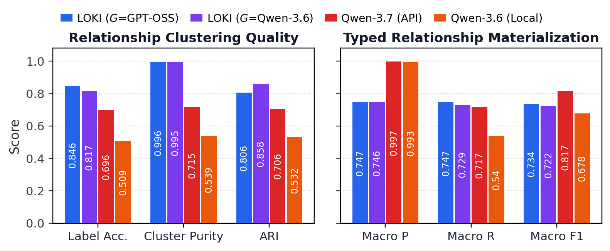
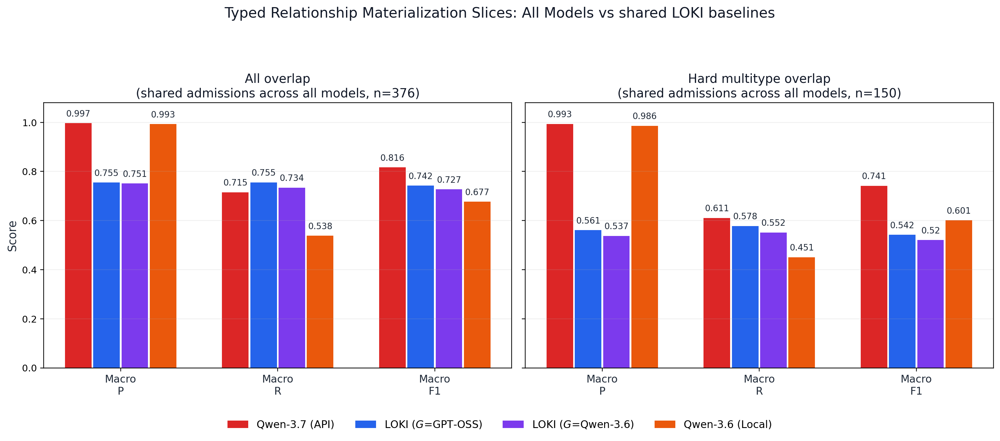
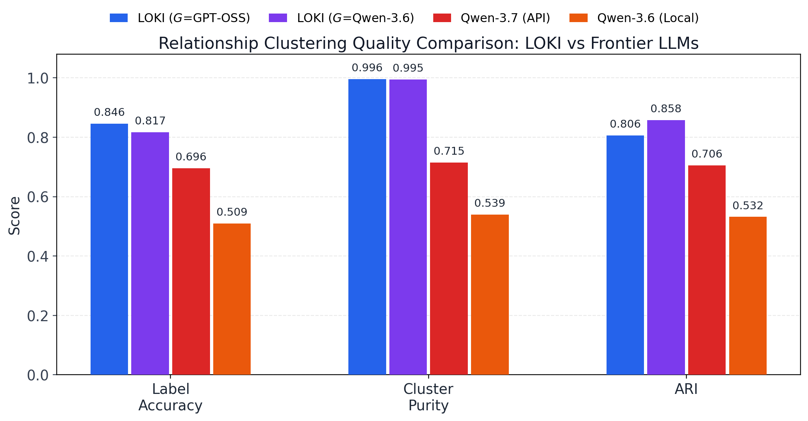
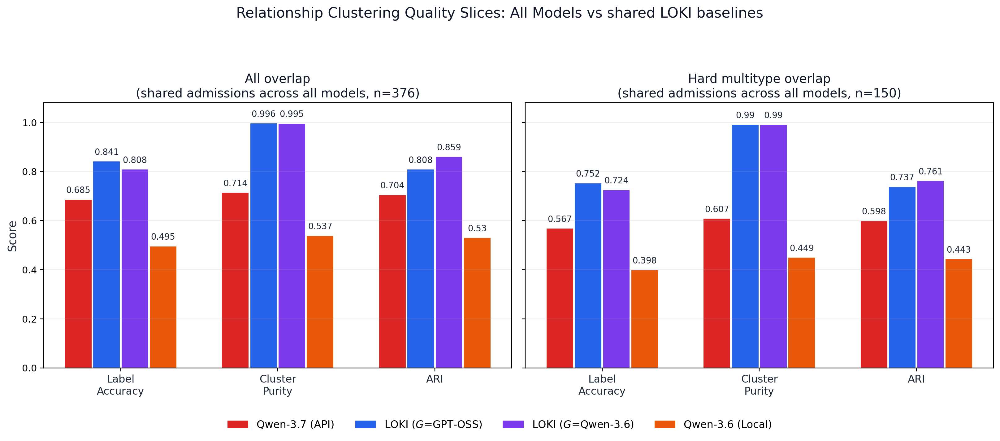
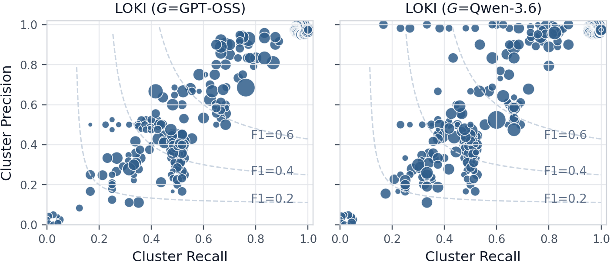
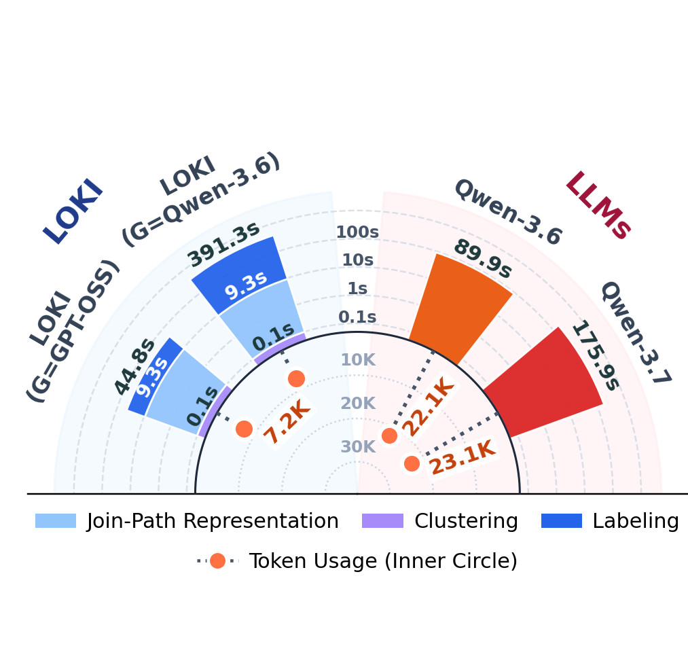
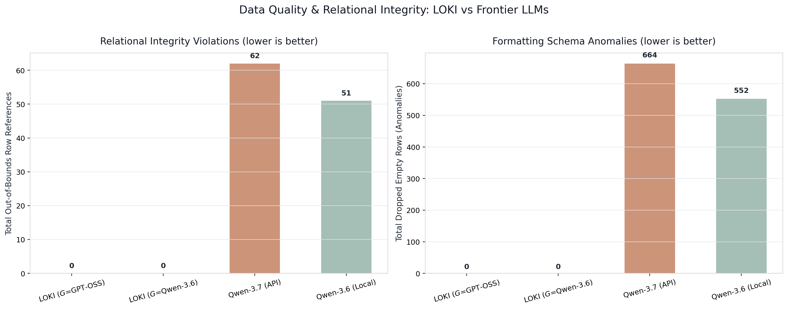
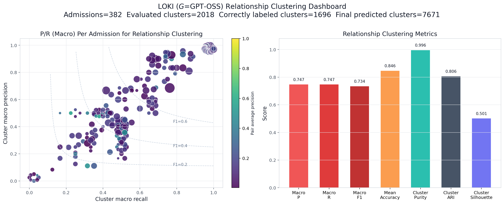
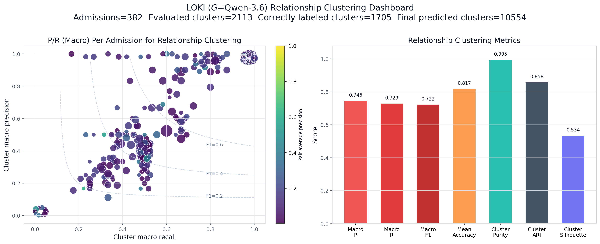

# Visual Artifacts & Benchmark Figure Gallery

This directory contains the publication-ready figures for the LOKI evaluation on the MIMIC-IV dataset. All figures are generated as both high-resolution PNGs and vector-graphics PDFs.

---

## 1. Primary Benchmark Figures

### 1.1 Main Comparison: Relationship Clustering Quality vs. Typed Materialization
Dual-panel comparison illustrating structural partition quality (left) alongside semantic relationship materialization performance (right).

*Vector PDF: [`all_models_main_comparison_metrics.pdf`](all_models_main_comparison_metrics.pdf)*

---

### 1.2 Typed Relationship Materialization (Full Cohort)
Macro-averaged Precision, Recall, and F1 across all 382 MIMIC-IV admissions.

---

### 1.3 Matched-Support Evaluation & Multitype Complexity
Performance across strictly matched admission cohorts: overall matched cohort (left) and complex multi-type overlap admissions (right).

*Vector PDF: [`all_models_semantic_integration_slices.pdf`](all_models_semantic_integration_slices.pdf)*

---

## 2. Cluster Structure & Partition Quality

### 2.1 Cluster Quality Diagnostics
Label Accuracy, Cluster Purity, and Adjusted Rand Index (ARI). LOKI achieves near-perfect purity ($\ge 0.995$) and superior partition agreement ($\text{ARI} \ge 0.806$).

*Vector PDF: [`all_models_relationship_clustering_metrics.pdf`](all_models_relationship_clustering_metrics.pdf)*

---

### 2.2 Cluster Quality Across Matched Slices
Evaluation of partition structure on matched subsets, showing sustained high purity even on complex admissions.

*Vector PDF: [`all_models_relationship_clustering_slices.pdf`](all_models_relationship_clustering_slices.pdf)*

---

### 2.3 LOKI Per-Admission Clustering Distribution
Admission-level scatter plot comparing `LOKI + GPT-OSS 20B` and `LOKI + Qwen-3.6`. Points represent individual admissions plotted by cluster recall vs. precision, colored by Macro F1.

---

## 3. Compute Efficiency & Data Quality

### 3.1 Compute Runtime & Token Economics
End-to-end execution runtime and LLM token footprint trade-offs across systems, highlighting LOKI's $>67\%$ reduction in LLM token consumption.

*Vector PDF: [`all_models_compute_cost_half_circle.pdf`](all_models_compute_cost_half_circle.pdf)*

---

### 3.2 Relational Integrity & Schema Adherence
Structural data quality diagnostics evaluating primary key/foreign key constraints and relational schema adherence.

---

## 4. Pipeline Dashboards

### 4.1 LOKI + GPT-OSS 20B Dashboard

*Vector PDF: [`LOKI_GPT-OSS_20B_relationship_clustering_dashboard.pdf`](LOKI_GPT-OSS_20B_relationship_clustering_dashboard.pdf)*

### 4.2 LOKI + Qwen-3.6 Dashboard

*Vector PDF: [`LOKI_Qwen-3.6_relationship_clustering_dashboard.pdf`](LOKI_Qwen-3.6_relationship_clustering_dashboard.pdf)*

---

## 5. Frontier Baseline Diagnostics

### 5.1 Predicted Cluster Counts per Admission
Distribution of induced relation groups per admission, illustrating monolithic baseline tendencies toward coarse over-aggregation.
- **Qwen-3.7-Max:** [`Qwen-3.7_relationship_clustering_cluster_counts.png`](Qwen-3.7_relationship_clustering_cluster_counts.png) *(PDF: [`Qwen-3.7_relationship_clustering_cluster_counts.pdf`](Qwen-3.7_relationship_clustering_cluster_counts.pdf))*
- **Qwen-3.6-Local:** [`Qwen3.6-Local_relationship_clustering_cluster_counts.png`](Qwen3.6-Local_relationship_clustering_cluster_counts.png) *(PDF: [`Qwen3.6-Local_relationship_clustering_cluster_counts.pdf`](Qwen3.6-Local_relationship_clustering_cluster_counts.pdf))*

### 5.2 Oracle F1 Deltas Relative to LOKI
Per-admission performance deltas between prompt baselines and LOKI.
- **Qwen-3.7-Max Delta:** [`Qwen-3.7_relationship_clustering_raw_oracle_f1_delta.png`](Qwen-3.7_relationship_clustering_raw_oracle_f1_delta.png) *(PDF: [`Qwen-3.7_relationship_clustering_raw_oracle_f1_delta.pdf`](Qwen-3.7_relationship_clustering_raw_oracle_f1_delta.pdf))*
- **Qwen-3.6-Local Delta:** [`Qwen3.6-Local_relationship_clustering_raw_oracle_f1_delta.png`](Qwen3.6-Local_relationship_clustering_raw_oracle_f1_delta.png) *(PDF: [`Qwen3.6-Local_relationship_clustering_raw_oracle_f1_delta.pdf`](Qwen3.6-Local_relationship_clustering_raw_oracle_f1_delta.pdf))*

