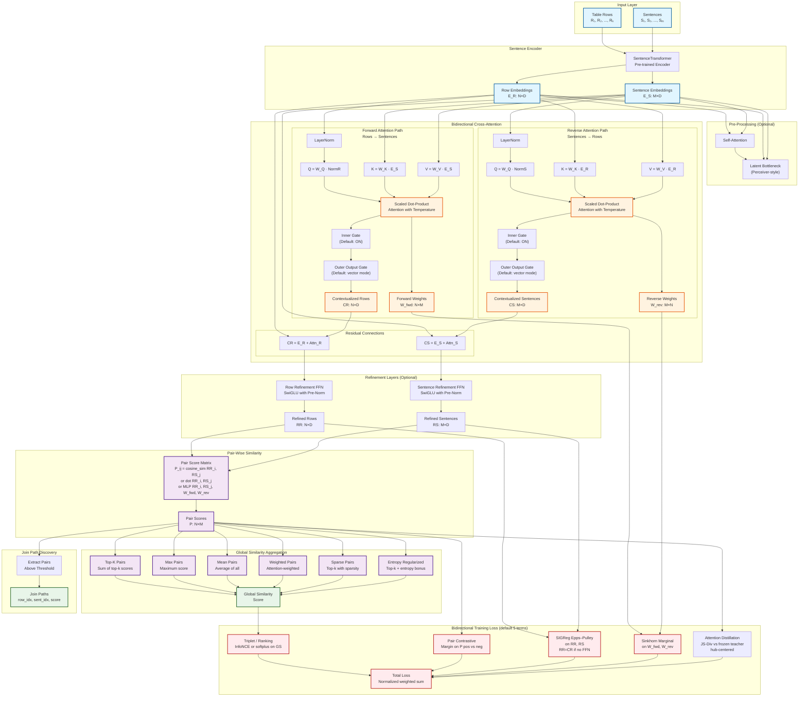
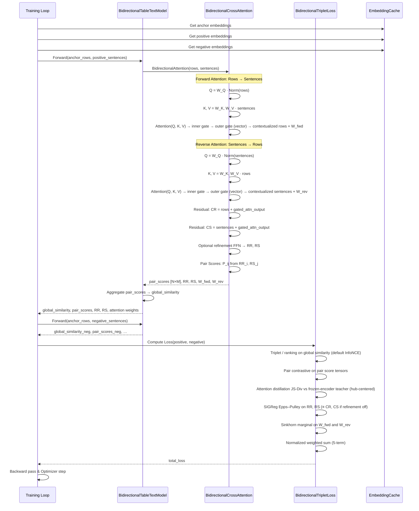

# Bidirectional Cross-Attention Architecture Diagram

## Overview

This document describes the bidirectional cross-attention stack used in LOKI for table–text alignment and join-path discovery. Training uses a **five-term objective**: triplet ranking on aggregated similarity, pair-level contrastive loss on the pair-score matrix, **Epps–Pulley SIGReg** on the tensors returned after the attention residual (with an **optional** refinement FFN when enabled), a **Sinkhorn-style marginal** penalty on attention matrices, and **attention distillation** (JS divergence between LOKI's pair scores and a frozen-encoder teacher, with hub-centering). The architecture also uses a **double-gate** by default: an **outer query-dependent output gate** (`AttentionOutputGate`, vector mode) in `BidirectionalCrossAttention` plus an **inner gate** inside the sparse-attention module. Older auxiliary losses (attention entropy, diversity, direct/forward anti-collapse, pair MIL, legacy VICReg-style `sigreg_loss`) still exist in `losses.py` and `run_cross_attention.py` but ship with **zero default weight** and are omitted from the diagrams below.

Batch join materialization (`materialize_joins.py`) is a separate pipeline and is not represented here until that workflow is finalized.

---

## Component Glossary

| Node / Group | Stage | One-line description |
|:---|:---|:---|
| **R, S** | Input | Raw table rows and clinical note sentences fed into the pipeline. |
| **SE** | Encoder | Pre-trained `SentenceTransformer` (e.g., MedEmbed-large). Shared encoder for both rows and sentences; weights are frozen or fine-tuned via LoRA. |
| **E_R** (RE) | Encoder | Dense row embeddings produced by linearizing each table row and encoding it; shape N×D. |
| **E_S** (SE2) | Encoder | Dense sentence embeddings for each note sentence; shape M×D. |
| **SA / LB** | Pre-processing (opt.) | Optional self-attention and Perceiver-style latent bottleneck applied before cross-attention to compress or re-contextualize inputs. Off by default. |
| **FN1 / RN1** | Attention | LayerNorm applied to the query side (rows for forward, sentences for reverse) before projection. Keys/values are left unnormalized. |
| **FQ, FK, FV** | Forward attention | Learned linear projections W_Q, W_K, W_V that map rows → queries and sentences → keys/values for the forward (row-to-sentence) attention head. |
| **RQ, RK, RV** | Reverse attention | Symmetric projections for the reverse (sentence-to-row) head; sentences become queries, rows become keys/values. |
| **FATTN / RATTN** | Attention | Scaled dot-product attention with learned temperature; output is a weighted sum of values plus the N×M (or M×N) attention weight matrix W_fwd / W_rev. |
| **FAW / RAW** (W_fwd, W_rev) | Attention | Raw attention weight matrices retained for Sinkhorn regularization and optional visualization. FAW is N×M; RAW is M×N. |
| **FINNER / RINNER** | Gate (inner) | Per-element sigmoid gate applied **inside** the sparse-attention module before its output is returned. Default **on**; learned independently from the outer gate. |
| **FOUT / ROUT** | Gate (outer) | `AttentionOutputGate`: query-dependent vector gate σ(W · query) applied **after** the inner attention output in `BidirectionalCrossAttention`. Default **on**, vector mode. Learns which dimensions of the cross-attention context to pass through. |
| **RES1 / RES2** | Residual | Residual addition: CR = E_R + gated\_attn\_output; CS = E_S + gated\_attn\_output. Produces contextualized representations. |
| **CR / CS** | Residual output | Post-residual contextualized row (CR, N×D) and sentence (CS, M×D) vectors. Inputs to the optional refinement FFN and to SIGReg. |
| **RF1 / RF2** | Refinement (opt.) | SwiGLU feed-forward network with pre-norm applied separately to CR and CS. Enabled via `--use_refinement`; **off by default**. |
| **RR / RS** | Pair scoring input | Final row (RR) and sentence (RS) representations entering pair scoring. Equal to CR/CS when refinement is off; equal to FFN(CR)/FFN(CS) when on. |
| **PS1 / PS2** (P) | Pair scoring | N×M pair score matrix where P_ij = cosine\_sim(RR_i, RS_j). The central alignment signal used for both loss computation and join-path extraction. |
| **AG1–AG6 / GS** | Aggregation | Six aggregation strategies (top-k, max, mean, weighted, sparse, entropy-regularized) that reduce P to a scalar global similarity score used by the ranking loss. |
| **L1** | Loss | **Triplet / ranking loss** — InfoNCE (default) on the global similarity scalar; pulls positive pairs above negatives. |
| **L3** | Loss | **Pair contrastive loss** — margin-based loss directly on P; discourages negative pair-score mass in positive contexts. |
| **LDIST** | Loss | **Attention distillation loss** — JS divergence between the student's P and the frozen-encoder teacher's pair-score distribution (hub-centered, temperature-scaled). Preserves zero-shot alignment during training. |
| **LSIG** | Loss | **SIGReg (Epps–Pulley)** — random-projection test for Gaussianity on RR and RS; penalizes dimensional collapse and distribution mismatch. |
| **LSK** | Loss | **Sinkhorn marginal loss** — soft row/column marginal constraint on FAW and RAW; discourages hub sentences from dominating all attention mass. |
| **TL** | Loss | **Total loss** — normalized weighted sum of all active terms (weights sum to 1 after normalization). |
| **JP1 / JP2** | Output | Join-path extraction: threshold P to get candidate (row, sentence) atomic links; output is a list of (row\_idx, sent\_idx, score) triples passed to `materialize_joins.py`. |

---

## Architecture Flow Diagram

---

## Default training objective (relative weights)

`run_cross_attention.py` normalizes the following **relative** weights so they sum to 1 after dividing each by their total. The five active terms sum to a raw relative total of 1.20, giving the effective normalized mix below:

| Term | Relative weight | Normalized | Role |
|:-----|:----------------|:-----------|:-----|
| Triplet / ranking | 0.50 | ≈ 0.417 | Pull positive global similarity above negative (default: InfoNCE on aggregated score) |
| Pair contrastive | 0.30 | 0.250 | Discourage negative pair-score mass versus positive contexts |
| Attention distillation | 0.20 | ≈ 0.167 | JS divergence between LOKI pair scores and frozen-encoder teacher; hub-centering on teacher side |
| SIGReg (Epps–Pulley) | 0.15 | 0.125 | Isotropic-Gaussian prior on embeddings returned after attention residuals, optionally after the refinement FFN (`EppsPulleySIGReg` in `losses.py`) |
| Sinkhorn marginal | 0.05 | ≈ 0.042 | Soft marginal constraint on forward/reverse attention to limit hub keys |

Implementation notes:

- `BidirectionalTripletLoss` requests `return_contextualized=True` when `sigreg_weight > 0` and `return_attention_weights=True` when Sinkhorn or legacy direct/forward attention terms need weights; with the default config, SIGReg, Sinkhorn, and attention distillation are all active.
- The tensors fed to SIGReg are the **refined** row/sentence representations returned from `BidirectionalCrossAttention` (residual after attention, **optionally** plus refinement FFN via `--use_refinement`, default **off** in `run_cross_attention.py`). When refinement is disabled, those tensors are identical to the post-residual contextualized vectors CR/CS. They are the same stage used to form `P`.
- Attention distillation compares the student pair-score matrix `P` (post cross-attention) to the teacher's pair-score matrix (frozen encoder cosine similarities, hub-centered by subtracting the per-sentence mean across rows before softmax). The default divergence measure is Jensen–Shannon (`js_div`). Teacher temperature 0.5, student temperature 0.1.

---

## Detailed Component Diagram

```mermaid
graph LR
    subgraph "Bidirectional Cross Attention"
        subgraph "Forward Attention: Rows Attend to Sentences"
            direction TB
            FR[Row Embeddings<br/>N×D] -->|LayerNorm| FN[Normalized Rows]
            FS[Sentence Embeddings<br/>M×D] -->|No Norm| FS2[Sentences]
            FN -->|W_Q| FQ[Queries<br/>N×D_attn]
            FS2 -->|W_K| FK[Keys<br/>M×D_attn]
            FS2 -->|W_V| FV[Values<br/>M×D_attn]
            FQ -->|QK^T / √d| FSCORES[Attention Scores<br/>N×M]
            FK -->|QK^T / √d| FSCORES
            FSCORES -->|/ Temperature| FTEMP[Scaled Scores]
            FTEMP -->|Softmax/Entmax| FWEIGHTS[Attention Weights<br/>N×M]
            FV -->|Weighted Sum| FOUT[Contextualized Rows<br/>N×D]
            FWEIGHTS -->|Weighted Sum| FOUT
            FOUT -->|inner gate → outer gate → residual| CR[Final Contextualized Rows<br/>N×D]
        end
        
        subgraph "Reverse Attention: Sentences Attend to Rows"
            direction TB
            SR[Sentence Embeddings<br/>M×D] -->|LayerNorm| SN[Normalized Sentences]
            RR0[Row Embeddings<br/>N×D] -->|No Norm| RR2[Rows]
            SN -->|W_Q| RQ[Queries<br/>M×D_attn]
            RR2 -->|W_K| RK[Keys<br/>N×D_attn]
            RR2 -->|W_V| RV[Values<br/>N×D_attn]
            RQ -->|QK^T / √d| RSCORES[Attention Scores<br/>M×N]
            RK -->|QK^T / √d| RSCORES
            RSCORES -->|/ Temperature| RTEMP[Scaled Scores]
            RTEMP -->|Softmax/Entmax| RWEIGHTS[Attention Weights<br/>M×N]
            RV -->|Weighted Sum| ROUT[Contextualized Sentences<br/>M×D]
            RWEIGHTS -->|Weighted Sum| ROUT
            ROUT -->|inner gate → outer gate → residual| CS[Final Contextualized Sentences<br/>M×D]
        end
        
        subgraph "Pair Scoring"
            direction TB
            CR -->|Refinement FFN| RR[Refined Rows<br/>N×D]
            CS -->|Refinement FFN| RS[Refined Sentences<br/>M×D]
            RR -->|Cosine/Dot/MLP| PS[Pair Score Matrix<br/>P_ij: N×M]
            RS -->|Cosine/Dot/MLP| PS
            FWEIGHTS -->|Optional| PS
            RWEIGHTS -->|Optional| PS
        end
    end
    
    subgraph "Total Loss<br>(Normalized Weighted Sum)"
        PS -->|Aggregation| GS[Global Similarity<br/>Scalar]
        PS -->|Extract| JP[Join Paths<br/>row_idx, sent_idx, score]
        RR -->|Epps–Pulley| SIG[SIGReg Loss]
        RS -->|Epps–Pulley| SIG
        FWEIGHTS -->|Marginal penalty| SK[Sinkhorn Loss]
        RWEIGHTS -->|Marginal penalty| SK
        GS -->|Ranking| TR[Triplet Loss]
        PS -->|Contrastive| PC[Pair Contrastive Loss]
        PS -->|JS-Div vs frozen teacher| DIST[Attention Distillation Loss]
    end
    
    style CR fill:#fff3e0,stroke:#e65100
    style CS fill:#fff3e0,stroke:#e65100
    style PS fill:#f3e5f5,stroke:#4a148c
    style GS fill:#e8f5e9,stroke:#1b5e20
    style JP fill:#e8f5e9,stroke:#1b5e20
```

---

## Training Flow Diagram

---

## Key Features

### 1. Bidirectional attention

- **Forward path**: Rows attend to sentences → contextualized row vectors (CR).
- **Reverse path**: Sentences attend to rows → contextualized sentence vectors (CS).
- Both paths use residuals `output = input + gated_attention(norm(input))` with a **double gate** on by default: an inner gate inside the sparse-attention module and an outer query-dependent `AttentionOutputGate` (vector mode, sigmoid-activated linear on the query representations) applied before the residual add. Temperature scaling is enabled by default (unless `--disable_temperature`).

### 2. Refinement FFN (optional)

- **Flag**: `--use_refinement` in `run_cross_attention.py` (default **False**).
- **Behavior**: If off, `BidirectionalCrossAttention` does not apply the SwiGLU blocks; it sets `refined_* = contextualized_*` (i.e. RR ≡ CR, RS ≡ CS). Pair scores and SIGReg still use those returned tensors; the diagram keeps labels RR/RS for the tensors that enter `P` and the regularizer.

### 3. Pair score matrix
    
- **N×M** matrix of similarities between the row/sentence vectors **after** the optional refinement step (or after residuals only, if refinement is off).
- **Methods**: Cosine (default), dot product, or MLP incorporating attention features.

### 4. Aggregation methods

- **top_k_pairs**: Sum of top-k scores (common default for global similarity).
- **max_pairs**, **mean_pairs**, **weighted_pairs**, **sparse_pairs**, **entropy_regularized**: Alternative global scores; training uses the configured `aggregation_method` for the scalar fed into the ranking loss.

### 5. Loss components (default five-term stack)

- **Triplet / ranking**: Compares positive vs. negative **global** similarity; default `ranking_loss_type` is **InfoNCE** (`--ranking_loss_type infonce`, temperature `--infonce_tau`), with softplus margin still available.
- **Pair contrastive**: Margin-based separation using positive vs. negative **pair-score** tensors.
- **Attention distillation** (`--use_attention_distillation`, default **True**, weight 0.20): JS divergence between the student's pair-score matrix `P` and a frozen-encoder teacher's pair-score distribution. Teacher scores are hub-centered (per-sentence mean subtracted across rows) before softmax at temperature 0.5; student at temperature 0.1. Preserves zero-shot row-sentence alignment quality during training.
- **SIGReg**: `EppsPulleySIGReg` (LeWM-style random projections + Epps–Pulley statistic) on **positive and optionally negative** embeddings at the same stage as pair scoring (refined if the FFN is on; otherwise post-attention CR/CS)—not the legacy VICReg-style `sigreg_loss()` helper, which remains for compatibility.
- **Sinkhorn**: `sinkhorn_reg_loss` encourages balanced marginals on **both** attention maps to reduce universal hub sentences.

Legacy components (attention entropy, diversity, direct/forward anti-collapse, pair MIL) are not shown above; they can be re-enabled via CLI for ablations.

### 6. Join path extraction

- Derived from the pair score matrix via thresholding or top-k selection.
- Returns `(row_idx, sentence_idx, score)` tuples.

---
